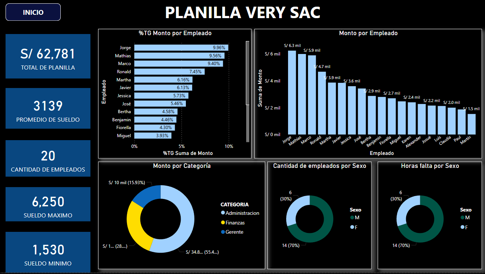
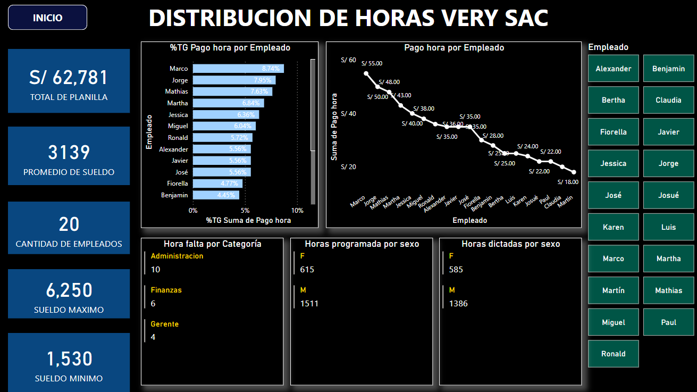

# Dashboard salarial de VERY SAC Power Bi

## Introducción

Este dashboard proporciona una visión general concisa y visual de la información salarial de la empresa VERY SAC. A través de una serie de gráficos y métricas clave, se pueden extraer conclusiones importantes sobre la composición de la plantilla, los costos salariales y otras variables relevantes para la gestión de recursos humanos.

Secciones del Dashboard:

- Total de Planilla y Promedio de Sueldo: En la parte superior izquierda, se muestra el costo total de la planilla y el sueldo promedio de los empleados. Estos indicadores generales brindan una visión rápida de la masa salarial de la empresa.
- Cantidad de Empleados: Esta sección muestra el número total de empleados en la empresa, lo que permite tener una idea del tamaño de la plantilla.
- Sueldo Máximo y Mínimo: Estos valores indican la dispersión salarial dentro de la empresa, lo que puede ser útil para identificar posibles inequidades o oportunidades de ajuste salarial.
- %TG Monto por Empleado: Esta sección muestra un gráfico de barras que representa el porcentaje de la planilla total que corresponde a cada empleado. Permite identificar a los empleados con los salarios más altos y aquellos con salarios más bajos.
- Monto por Empleado: Este gráfico de barras complementa al anterior, mostrando el monto exacto del sueldo de cada empleado.
- Monto por Categoría: Este gráfico circular muestra la distribución de los salarios por categoría laboral (Administración, Finanzas, Gerencia, etc.). Permite identificar en qué áreas se concentra la mayor parte de la masa salarial.
- Cantidad de Empleados por Sexo: Este gráfico circular muestra la distribución de los empleados por género, lo que puede ser útil para analizar la equidad de género en la empresa.
- Horas Extra por Sexo: Este gráfico (aunque no se muestra en la imagen proporcionada) probablemente muestra la cantidad de horas extras trabajadas por cada género, lo que permite identificar posibles disparidades en la carga de trabajo.

# Distribución de horas VERY SAC

Esta parte se enfoca en la distribución de horas trabajadas, proporcionando una perspectiva complementaria al dashboard anterior que se centraba en los salarios.

- %TG Pago hora por Empleado: Similar al dashboard anterior, esta sección muestra el porcentaje de la planilla total que representa el pago por hora de cada empleado, pero ahora enfocado en el pago por hora en lugar del sueldo mensual.
- Pago por hora por Empleado: Este gráfico de líneas muestra la evolución del pago por hora de cada empleado a lo largo del tiempo. Permite identificar aumentos o disminuciones salariales, así como variaciones en el pago por hora entre diferentes empleados.
- Horas falta por Categoría: Esta sección muestra la cantidad de horas no trabajadas por cada categoría laboral. Puede indicar problemas de asistencia, permisos o falta de carga de trabajo.
- Horas programadas por sexo y Horas dictadas por sexo: Estas secciones permiten analizar la distribución de las horas trabajadas por género, lo que puede revelar posibles inequidades o desequilibrios en la carga de trabajo.

En ambos, se obtiene una visión más completa de la gestión de recursos humanos en VERY SAC. Esta información es crucial para tomar decisiones estratégicas que permitan optimizar los costos, mejorar la eficiencia y garantizar la equidad en el lugar de trabajo.

